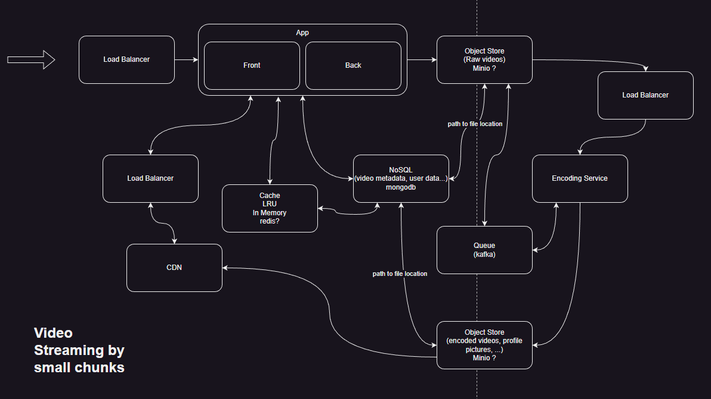

# Youtube-Design-System

Project aiming to create a video streaming app in the same vein as Youtube based on the Design System video of:
https://www.youtube.com/watch?v=jPKTo1iGQiE

## Description

This app will allow the upload and streaming of videos and possibly more in the long term
This is a personnal project with the goal of discovering new technologies, improving the ones that I know already like:

- Caddy
- Docker
- Fastify
- Kafka
- Kubernetes
- Lerna
- Linkerd
- Minio
- Mongodb
- NestJS
- NextJS
- Nginx
- RadixUI
- React-query-library
- React-Server-Components
- Redis
- Server-Side-Rendering
- tRPC
- Typescript
  and more...

## Installation and usage

### Frontend

Start the frontend

```bash
yarn frontend:start
```

or in dev mode

```bash
yarn frontend:start:dev
```

### Backend

Start the backend

```bash
yarn backend:start
```

or in dev mode

```bash
yarn backend:start:dev
```

### Mongo Database

Build the container and run it:

```bash
docker-compose up
```

Init the database:

```
yarn mongo:init
```

Seed some fake data into it:

```
yarn mongo:seed:mock:videos
```

## Features added

to add

## Features to add

to add

## Detailed Description



### Frontend

The frontend application will be created in NextJS

### Backend

The backend application will be created in NestJS

### Encoding

The encoding service will be written in fastify

### CDN

To serve file faster we will be using a Caddy CDN server

### Caching

To serve metadata faster to the frontend we will be using Redis for data susceptible to be fetched often

### Queuing

To handle the encoding service we will be using a queuing service using Kafka

### Object storing

To store raw videos, encoded videos and other files we will be storing them in an object storage using Minio

### Non Normalized Data Storing

To store metadatas of videos, data about users, and other non normalized data we will be using Mongodb

### Containerization

To allow for a simple deploiement we will be using docker containers and kubernetes

### Load Balancing

The application will require multiple load balancer between key services that will be using Nginx

### Serice Meshing

To allow monitoring of the various microservices we will be using Linkerd

### Monorepo

This project containing multiple services and applications the project will be using a monorepo structure using Lerna

## Commit convention

<type>[optional scope]: <description>

with type being:

- build: Changes that affect the build system or external dependencies (example scopes: gulp, broccoli, npm)
- ci: Changes to our CI configuration files and scripts (example scopes: Travis, Circle, BrowserStack, SauceLabs)
- docs: Documentation only changes
- feat: A new feature
- fix: A bug fix
- perf: A code change that improves performance
- refactor: A code change that neither fixes a bug nor adds a feature
- style: Changes that do not affect the meaning of the code (white-space, formatting, missing semi-colons, etc)
- test: Adding missing tests or correcting existing tests

The scope should be the name of the npm package affected as perceived by the person reading the changelog generated from commit messages.

from the Angular project commit convention https://github.com/angular/angular/blob/22b96b9/CONTRIBUTING.md#-commit-message-guidelines

## Licence

This project is licensed under the MIT License [LICENSE](./LICENSE.md) - see file for details
